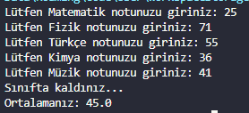

# Ders Ortalaması Hesaplayan Program
Kullancıdan ders notlarını alıp ortalmasını bulup geçtiğini veya kaldığını bulur. Kullanıcının girdiği ders notları eğer 0 ve 100 arasında değilse öyle girilen dersleri ortalamaya eklemeden öyle ortalamayı hesaplar.

## Programın Fotoğrafı
